# CIS-566 Final Project

# Final Write-Up

LIVE DEMO: https://nmagarino.github.io/cis566---Final-Project/ 

We've implemented a fairly robust creature creation system.  A creature can have up to 4 pairs of procedurally generated limbs, one of 3 head types (that can be chosen specifically or randomized), and a randomly generated spine of 8 metaballs.  The creatures are also randomly colored by selecting 4 random colors and 2 of an assortment of textures.  The entire creature is an assortment of raymarched SDF primitives.

> SPINE

The spine is generated by creating 4 points and connecting them with a spline using De Casteljau's algorithm.  Metaballs are placed at successive positions along the spline.  We assign a random radius to each metaball by randomizing an initial radius, then changing that radius by a random amount between each metaball.  Metaballs with smaller radii are translated closer to the previous metaball to make sure that the torso is continuous.  

> HEAD

The head is randomly chosen from amongst 3 types (or selected by the user). Its size is determined by the average metaball radius of the entire spine, and its position aligns with the leading metaball of the spine.

> LIMBS

First, we randomize or read from user input the number of pairs of limbs.  Each limb is generated starting from a metaball position on the spine.  Limbs are initally distributed uniformly accross the torso metaballs, but are then randomly offset within their buckets. Generation begins starting from the back of the creature, creating legs. The individual limbs are generated choosing a random number of joints and assigning joint positions by randomizing a spherical change in position from the previous joint. If the joint is a leg, its final joint will always be at y = 0. The limb on the other side copies all values from its mirror, but negates all x values. After each pair of limbs is generated, the creature has a random chance to switch from generating legs to generating arms. Each joint is rendered as a sphere, and each sphere is connected by a capped cylinder, whose start and end radii are the same as the joint radii it is connected to.  Each capped cylinder begins oriented along the y-axis, and is rotated using rotation matrices that are computed CPU side and passed to the ray-marcher shader.  These rotation matrices are computed using quaternions as implemented by the glMatrix library in WebGL.  The quaternion used represents a rotation from a perfectly vertical vector (0,1,0) to the vector that represents the direction between two joints, and this quaternion is then converted to a mat4.  

Hands and Feet are hard coded SDFs that are placed at the position of the final joint in each limb.  Their size is based on the radii of the final joint in the respective limb.  Each foot is rotated slightly off from the x-axis on either side.  Each hand is rotated based on the final limb rotation in each limb.  Integers acting as boolean values are passed into the shader to determine whether a limb will generate a hand or a foot at the end (0 for foot, 1 for hand).

> TEXTURING

The creature generator selects 2 grayscale surface textures and generates 4 random colors. In the shader, after the normal of the creature at a point is determined, we use triplanar mapping to seamlessly map both textures in 3D space. Both textures are then used as an alpha to blend between 2 of the 4 colors. This results in 2 randomly colored textures that can be applied to the creature accross its surface. To add interest, we use the absolute value of the dot product of the surface normal of the creature to blend between textures such that one texture appears on upward-facing surfaces on the creature.

> ISSUES

Infrequently, a raymarching error occurs where a primitive is smoothed too intensely resulting in comprehensible geometry.  Due to the infrequent nature of this bug, debugging of this issue has proven difficult.  

Occasionally, limbs clearly collide with one another. A fix for this would require a complex bounding-box system in our creature generation function.

There are some visual artifacts on smaller SDFs, such as the cone-shaped teeth of two of the head types.  

> EXAMPLE CREATURES

Here are some of our favorite creatures that we created!

A Good Boy:
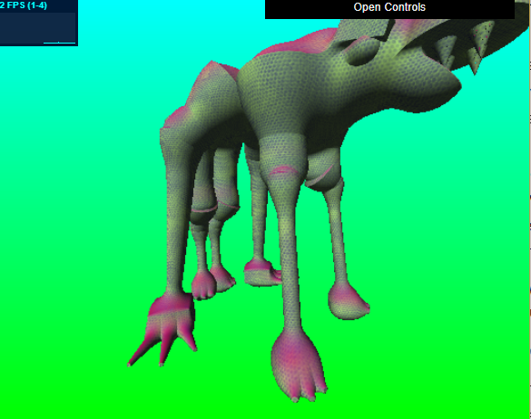

Albatross Jim:
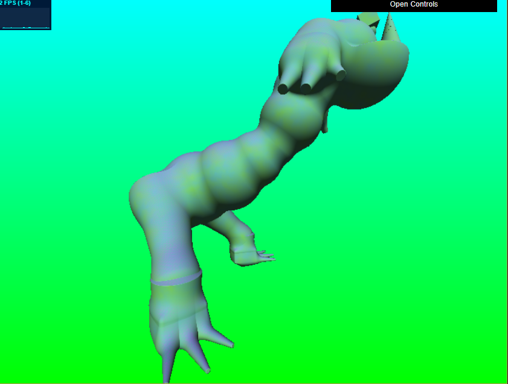

Chicken:
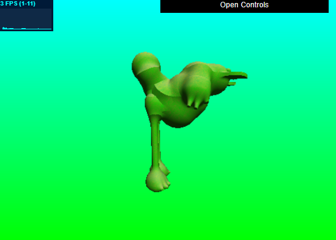

Doctor Levitz M.D.:
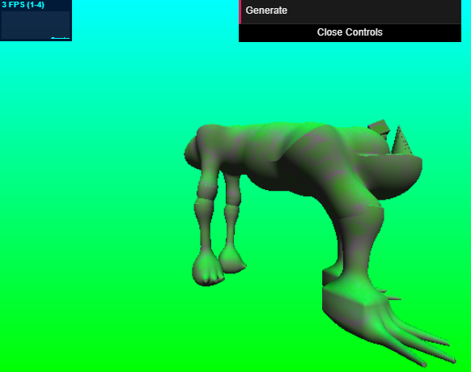

Momma Han:
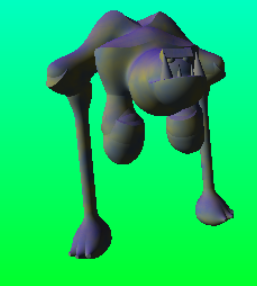

Spike:
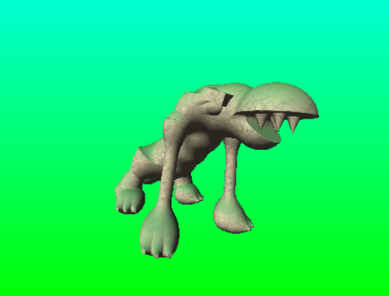

Sexy Legs:
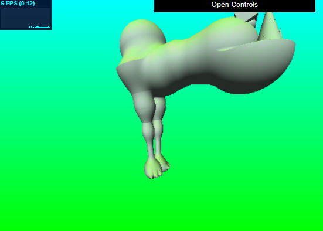

"Mom said it's my turn to play the X-box!":
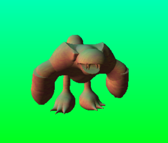

Winchester:
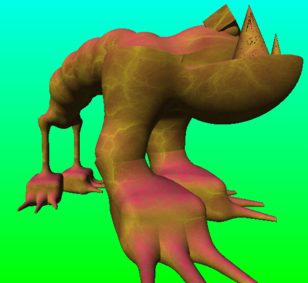

# Midpoint Milestone
 
So far we've basically met all of our milestones, finishing the spine class by week 1 and making progress on the limb class during week 2.  We've constructed our code from Nick's base code from the Implicit Surfaces homework (HW2).  

During week 1, Josh created a framework for the creature creator by making the Creature and Spine classes in src/bodyParts, then passing information from these classes to ray marcher ShaderProgram through src/main.ts.  This passed information contained sphere SDF positions and radii to construct the metaballs that make up the creature spine.  This spine is made of interpolated positions from 4 spline points, totalling 12 metaballs.
Nick then added a head to this spine, based on hard-coded head types, simply attached to the end of the first metaball.  For now, these heads are randomly chosen, but we're thinking of adding user interaction to select a head type.  Here are some random creatures!:

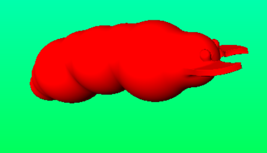

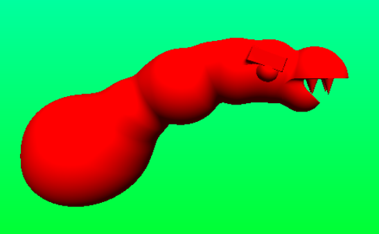

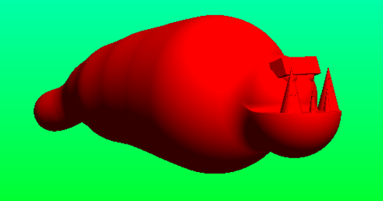

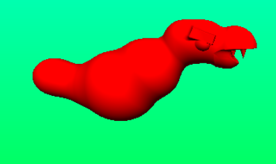

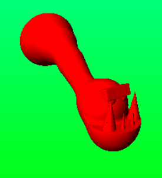

We're thinking of adjusting the metaball positioning a bit to avoid some more weird, unnatural, or undesirable body types (not to body-shame or anything):

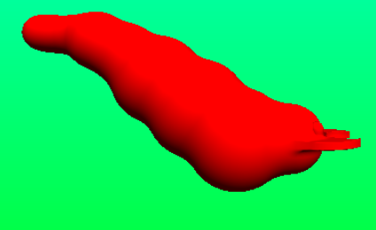

Additionally, we've begun working on limb construction.  For now, we have the framework for at least rendering some hard-coded arms and legs.  Just the limbs themselves will look something like this:

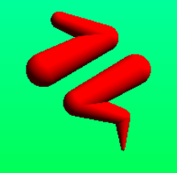

We're going to attach hard-coded hands and feet at the ends of these limbs.  Josh also added camera controls so that the creature can be freely viewed in 3d.  This can be seen in a demo.

Demo link: https://nmagarino.github.io/cis566---Final-Project/ 

From here, we plan on finishing implementation of the arms and legs by making them more procedurally generated/randomized.  We also plan on coloring different parts of the creature a separate color (aside from just red).  Our creature is already killing the FPS quite a bit, so we're thinking of using bounding boxes to optimize the ray marcher.

# Design Doc

Group Members: Josh Nadel and Nicholas Magarino

Introduction: What motivates this project?

The primary motivation for this project is the wide variety of procedural character creation interfaces that are present in so many modern (and older!) video games.  Specifically, we’re looking at the character creators that can generate completely random and still good-looking characters based on some amount of user input.

Goal: What do you intend to achieve with this project?

The goal of this project is to become familiar with a general procedure for procedurally generating characters, specifically how to make them interesting and coherent looking with as little manual tuning as possible and as much variety as possible.  We hope to learn how much user input could also appropriately affect the look of a random character.

Inspiration/reference: Attach some materials, visual or otherwise you intend as reference.

The primary inspiration will be the creature creator in Spore, which allows players to create or generate a creature of their choosing (given some premade assets).

Specification: Outline the main features of your project.

This project will allow a user to randomly generate a creature or robot (?), and also manipulate the features of said creature in some way (adjusting position of or adding body parts, changing color or shading, etc.).  The creator could allow the user to generate a random creature based on some base parameters.  For example, the user could specify the program to make something with 3 arms and 2 legs, that stands upright, and has 1 eye.

Techniques: What are the main technical/algorithmic tools you’ll be using? Give an overview, citing specific papers/articles.

Use metaballs to create organic looking forms for bodies
Use SDFs to create shapes with ray marching, use other SDF operations to smoothly blend shapes together
Need some way to automatically place the needed body parts given information about the previous body parts already in place (for example, where do we place the arms based on how many arms will be placed, and based on the dimensions of the torso).
Notes on Spore creature generation by Chris Hecker: http://chrishecker.com/My_liner_notes_for_spore#Creature_Skin_Mesh
Framework for Robot Construction Game: http://ieeexplore.ieee.org/stamp/stamp.jsp?arnumber=7332727

Design: How will your program fit together? Make a simple free-body diagram illustrating the pieces.

* User specifies inputs via GUI, generate button to start the process
* “Creature” class with array fields for different body parts
* Arms, Legs, eyes, details, etc arrays
* Body part types have their own classes containing all information needed to render that body part
* All body parts have a transformation
* Arms and legs have joint arrays
* Eyes might have a “color” field
* Raymarcher reads from body parts and generates the implicit geometry
* Textures determined by world space surface normal, position, designation of parts, etc

Timeline: Create a week-by-week set of milestones for each person in your group. Make sure you explicitly outline what each group member's duties will be.

> Week 1 - metaball spine
- Nick - spline implementation and rendering
- Josh - creature framwork & spline implementation
> Week 2 - limb class and rendering
- Nick - head class, limb rendering
- Josh - limb class construction and camera controls
> Week  3 - Placement algorithm - collision avoidance?
- Nick - user input, interaction
- Josh - randomization

